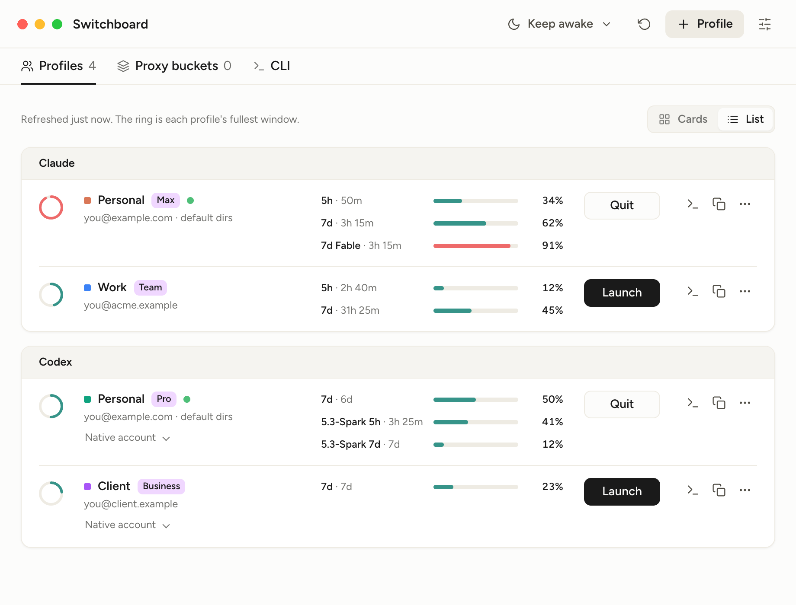

# Switchboard

**Run multiple Claude accounts at the same time on one Mac, and multiple
ChatGPT or Codex accounts too.** Two, or as many as you have memory for. Keep a
personal account and a work account both signed in, in their own desktop windows
and their own terminals, instead of logging out and back in every time you
switch. Each account also gets a live rate-limit bar, so you can see which one
has headroom left before you start.



It is for accounts you own. It does not rotate between accounts and it will not
switch automatically when a limit is reached.

## Can you run two Claude accounts at once? Or more?

Yes to both, and the same goes for Codex. There is no limit built in. Both
desktop apps are Chromium-based, so each account gets its own user-data
directory and runs as a genuinely separate window with its own session. The
command-line tools are separated the same way, with an environment variable per
account.

Each profile is isolated twice over, because the two halves hold different
state. Both desktop apps embed an agent that reads the same config-home
variable the command-line tool does, so the flag alone is not enough.

| App    | Signed-in session          | Agent home: sessions, plugins, config |
| ------ | -------------------------- | ------------------------------------- |
| Claude | `--user-data-dir=<…>/desktop` | `CLAUDE_CONFIG_DIR=<…>/home`       |
| Codex  | `--user-data-dir=<…>/desktop` | `CODEX_HOME=<…>/home`              |

Every account is a profile owning an isolated directory tree under
`~/.switchboard/<vendor>/<profile>/`. Profiles never share cookies, tokens,
chat history or session state, and you can run as many at once as you have
memory for.

The "Default" profiles point at the normal locations, `~/.claude`, `~/.codex`
and `~/Library/Application Support/{Claude,Codex}`. Switchboard never writes to
them itself.

## Does it work with Claude Code and the Codex CLI?

Yes. Each profile gets its own CLI login, and the **Terminal** button opens a
shell already inside that account, so `claude` or `codex` in that window uses
it. The one-line command on each card can be copied into an alias.

Signing a profile's CLI in is also what enables its usage bars.

## What are the rate-limit bars?

Every window the account has: the 5-hour and 7-day windows for Claude,
including model-scoped ones such as a separate Opus pool, and the weekly and
model-specific pools for Codex. Each shows how much is used, or how much is
left if you prefer, with the time until it resets. They turn amber and then red
as a window runs out.

You can read them in the menu bar without opening the window.

## Requirements

- A macOS whose `open` supports `--env`, which is how a profile's config home
  reaches the app. Confirmed on macOS 26; I have not established the earliest
  version that carries the flag, so check with `man open` if you are on
  something older.
- Claude Desktop, the ChatGPT app, or both, installed in `/Applications`.
  Other locations are not detected yet.
- The `claude` or `codex` CLI for the usage bars. Switchboard asks your login
  shell for its environment, so a version manager such as nvm, fnm, volta or
  mise is fine, and so is fish or bash rather than zsh.
- Apple Silicon has been tested. Intel should build, but has not been tried.

## What it reads, and what leaves your Mac

Worth knowing before you run an unsigned app that touches your accounts.

- **Your keychain.** To show Claude usage, Switchboard runs `security
  find-generic-password` for the entry the Claude Code CLI already created.
  macOS will ask for your password the first time. It asks again after each
  rebuild, because ad-hoc signing produces a new code hash and the keychain
  entry's permission no longer recognises the app. Codex tokens are read from a file
  instead, so they produce no prompt.
- **One network call per signed-in profile, on a timer.** The same endpoints
  the two CLIs use for their own usage screens, authorised with that profile's
  existing CLI token. Codex tries a second URL only if the first answers 404.
  Neither endpoint is documented by its vendor, so both can change without
  notice and the bars can go blank. Nothing else is sent anywhere and there is
  no telemetry.
- **Tokens never leave the main process.** They are read, used for that one
  request, and dropped. What the window receives is the profile's own name and
  colour, its directory paths and the CLI command to enter it, whether the app
  is running, and from the account: the email address, plan name, organisation
  name, and the usage percentages with their reset times.
- **Never credentials.** Switchboard does not write logins, and it will not copy
  API keys or credential helpers between profiles.

## Install

```bash
bun install
bun run install-app
```

That builds `Switchboard.app`, copies it to `/Applications`, ad-hoc signs it and
opens it. Launch it like any other app afterwards. Re-run the same command after
changing the source. For a dev run without installing, use `bun start`.

The app is not signed with a Developer ID and not notarised, so macOS may warn
about it. Building it yourself, as above, is the intended path.

It also lives in the menu bar with launch, quit and usage per profile, so you
can close the window and leave it running. Settings has an "Open at login"
switch; started that way it stays in the menu bar until you click it.

## Adding an account

1. Click **+ Profile**, pick the app and name it, then choose which existing
   profile to start from and what to bring over.
2. Click **Launch … app**. A fresh window opens with no session. Quit the other
   windows of that app first, using the "Quit others now" link on the card. The
   sign-in link is delivered to whichever window macOS picks.
3. Click **Sign in CLI**. A terminal opens running `claude auth login` or
   `codex login` inside that profile. This is what enables the usage bars.
4. **Terminal** opens a shell already inside the profile, in whichever terminal
   you choose in Settings. Terminal.app, iTerm2, Ghostty, Warp, kitty, Alacritty
   and WezTerm are supported, and only the installed ones are listed.

**Remove** on a card deletes the profile and everything under its directory:
the CLI login, the desktop session, history and settings. There is no way to
remove a profile and keep its data. The Default profiles cannot be removed.

### Keep in sync, or copy once

Items you bring over can be linked or copied, and the difference matters.

**Keep in sync** makes the new profile's file a symlink to the source profile's.
One edit then applies to both, which is the point for skills you maintain in one
place. It also means the reverse: if the second account's agent rewrites a file,
for example when it updates `CLAUDE.md` or `AGENTS.md` from a memory shortcut,
that write lands in the source profile too. Choose **Copy once** for anything you
want the two accounts to be able to change independently.

Chat history is always copied, never linked, because two accounts writing into
one session folder would corrupt each other's resume lists. For Codex it also
carries the sidebar's project list and which project each thread sits in, since
the app keeps that separately from the sessions and would otherwise show the
threads unplaced or, for ones run in worktrees, not at all.

Logins, memories and session state are never brought over at all. Connectors and
plugins are offered but off by default, because they reach the source account's
Slack, Notion and so on.

## Caveats

- Neither vendor supports any of this. An update to either app could break the
  `--user-data-dir` flag or the usage endpoints. The Default profiles keep
  working regardless.
- Launch extra profiles from Switchboard rather than from the Dock. A Dock
  launch carries neither the flag nor the variable, so it opens the Default
  profile regardless of which window you meant.
- Codex and ChatGPT are the same `ChatGPT.app` bundle, and every profile
  launches that one bundle, so an update to it applies to all of them. macOS
  registers each instance separately, which means one Dock icon per running
  profile rather than one for the app.
- If a profile's CLI token expires, run that profile's CLI once to refresh it.
- `ANTHROPIC_API_KEY` in your shell makes Claude Code bill the API instead of
  your subscription. Switchboard never sets it; check your own shell config.

## Development

```bash
bun test          # profile isolation and setup logic
bun run lint      # oxlint; `bun run test` runs it before the tests
bun run fmt       # oxfmt, Prettier-compatible; the CSS and HTML are left alone
bun start         # run without installing
bun run demo      # regenerate the screenshot and social card from invented accounts
bun run icons     # re-render the icon PNGs from build/icon.svg
```

The screenshot is produced by rendering the app's own UI against
[`demo/fixture.js`](demo/fixture.js), so it never contains anyone's real
accounts and stays current when the interface changes.

MIT licensed. See [LICENSE](LICENSE).
